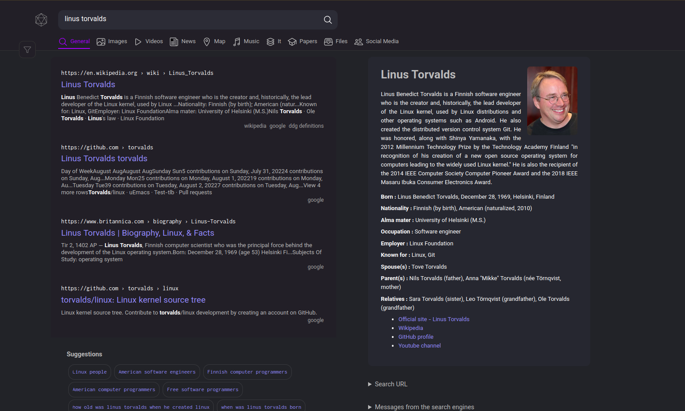
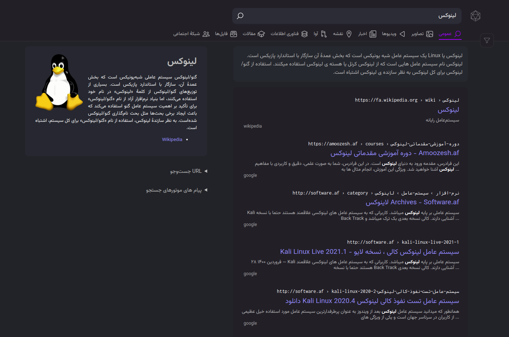
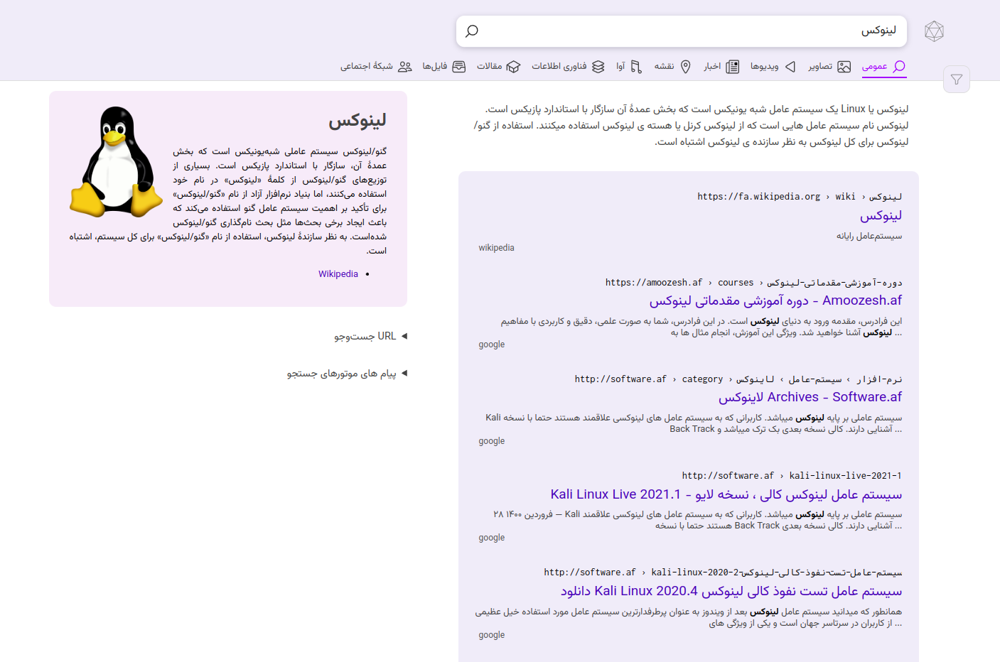

<div align="center">
  
</div>

MOA is a free and open source search engine based on the searxng project. This program was created with the aim of simplicity and usability for the general public, providing good and usable results while ensuring privacy, transparency and freedom on the Internet.

🚀 install
===

To install and use MOA, follow these steps:

1. Clone the repository by running the following command:
   ```
   git clone git@github.com:moa-engine/MOA
   ```

3. Navigate to the MOA directory:

   ```
   cd MOA
   ```

4. Run the web application using the following command:

      ```
      ./manage webapp.run
      ```
   

🏞️ Screenshots
===
Here are some screenshots of the application:






✋ participation
===

Please note that MOA is licensed under AGPL. If you would like to contribute, please send a message to @jmehr32 on Telegram. 

<h1 align="center">
  
</h1>
