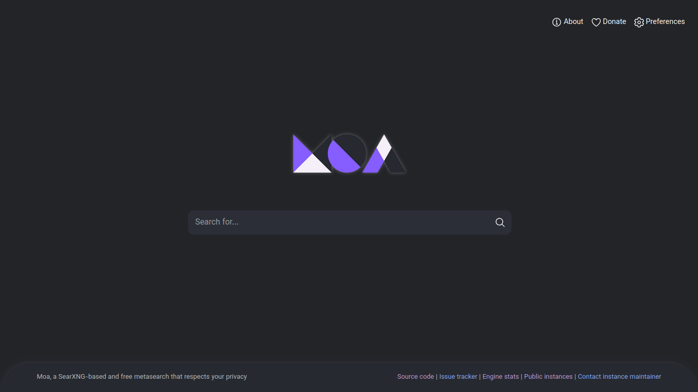
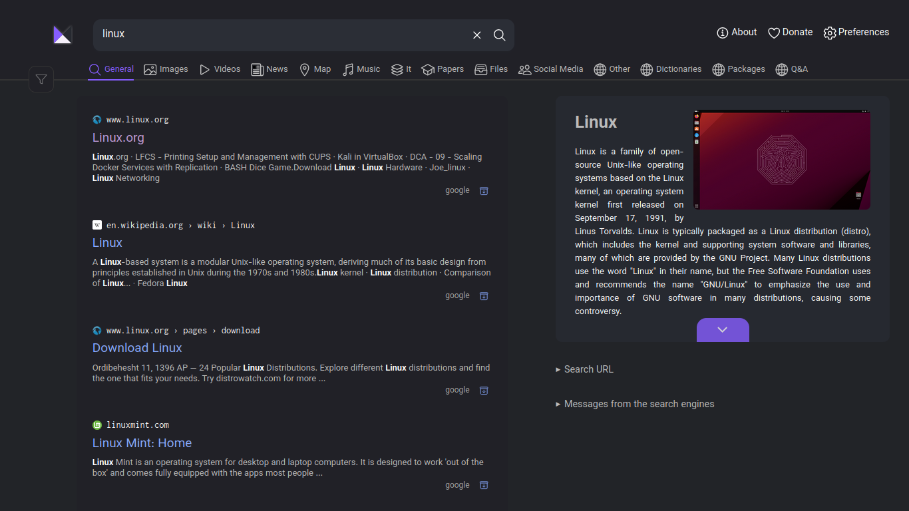
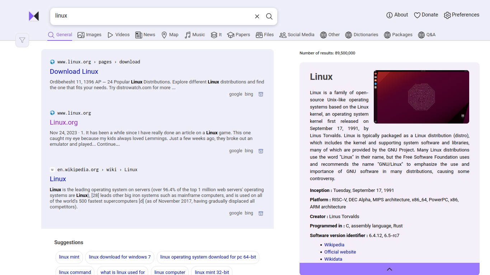

<div align="center">
  
</div>


MOA is a free and open source search engine based on the searxng project. This program was created with the aim of simplicity and usability for the general public, providing good and usable results while ensuring privacy, transparency and freedom on the Internet.


🌐 servers
===

| server | Server manager |
|--------|--------|
| https://moae.sbs (Official) | [MiladHossein](https://github.com/MiladHossein) |
| https://moa.mann-e.com | [prp-e](https://github.com/prp-e/) |
| https://moa.mahdium.ir | [mahdium](https://gitlab.com/mahdium) |

**MOA development group has no authority over unofficial servers.**

**Want to add your server to the list? Open a issues!**

🚀 install
===
To install and use MOA, follow these steps:

**with script:**

1. Clone the repository by running the following command:
   ```
   git clone git@github.com:moa-engine/MOA
   ```

2. Navigate to the MOA directory:

   ```
   cd MOA
   ```

3. Run the web application using the following command:

      ```
      make run
      ```
Now you can see MOA in your browser: https://localhost:8888

 **with Docker:**
  
1. install docker : (Debian Base Linuxs) 
   ```
   sudo apt install docker.io
   ```
   
2. Install from dockerhub :
   ```
   docker pull moaengine/moa
   ```
   
3. Run the Docker image
   ```
   docker run -p 8080:8080 moaengine/moa
   ```
   
Now you can see MOA in your browser: https://localhost:8080

🏞️ Screenshots
===
Here are some screenshots of the application:






✋ participation
===

Please note that MOA is licensed under AGPL. If you would like to contribute, please send a message to @[moa_engine](https://t.me/moa_engine) on Telegram. 
Or create a new issues in this repository
<h1 align="center">
  
</h1>
